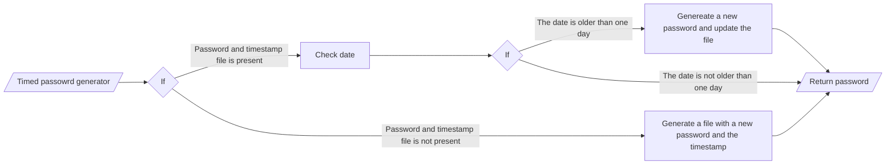

# Timed password generator in Classic ASP

## Class Logic

```mermaid
flowchart LR
    A[/Timed passowrd generator/] --> B{If}
    B --> |Password and timestamp file is present| C[Check date]
    B --> |Password and timestamp file is not present| D[Generate a file with a new password and the timestamp]
    C --> E{If}
    E --> |The date is older than one day| G[Genereate a new password and update the file]
    E --> |The date is not older than one day| F[/Return password/]
    D --> F
    G --> F
```

> "one day" is an example of time, in the class this parameter in editable
